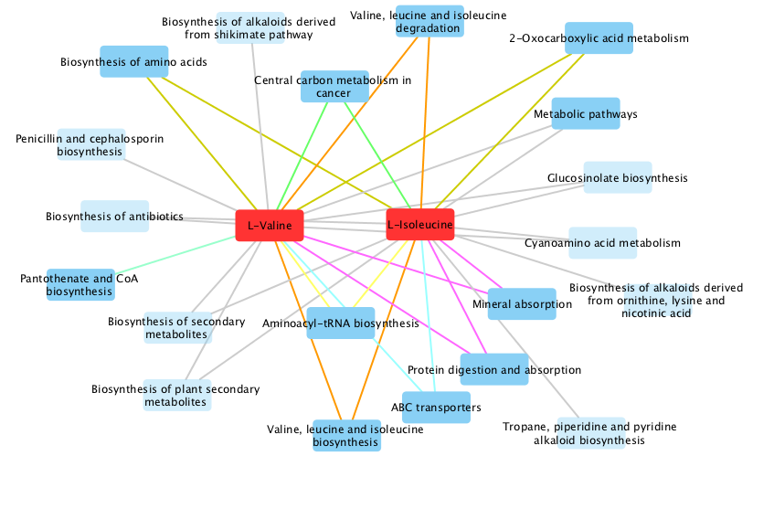

```{r setup, echo=FALSE}
knitr::opts_chunk$set(message=FALSE, fig.path='figures/')
```

<!-- Title block --> 
<br>
<p style="text-align:center;font-size:200%;color:Red"> MWASTools </p>
<p style="text-align:center;font-size:100%;color:Gray"> Andrea Rodriguez Martinez, 
Joram M. Posma, Rafael Ayala, Ana L. Neves, Maryam Anwar, Jeremy K. Nicholson, Marc-Emmanuel Dumas </p>
<p style="text-align:center;font-size:100%;color:Gray"> May 26, 2017 </p>
<br>

# Abstract

<p style="font-size:110%"> "MWASTools" is an R package designed to provide an integrated 
and user-friendly pipeline to analyze metabonomic data in the context of large-scale
epidemiological studies. Key functionalities of the package include: quality control analysis; 
metabolite-phenotype association models; data visualization tools; 
metabolite assignment using statistical total correlation spectroscopy (STOCSY);
and biological interpretation of MWAS results. <br><br> </p>

# Introduction

<p style="font-size:110%"> Metabonomics is a powerful systems biology approach that targets metabolites from biofluids (e.g. urine or plasma) or tissues, providing metabolic patterns that correspond to the metabolic status of the organism as a function of genetic and environmental influences [@nicholson2002]. Thanks to the recent developments in high-throughput platforms (i.e. nuclear magnetic resonance (NMR) and mass spectrometry 
(MS)), metabolic profiling is now being used for large-scale epidemiological applications 
such as metabolome-wide association studies (MWAS) [@holmes2008; @posma2015].</p>

<p style="font-size:110%"> Customized statistical modeling approaches and data visualization tools are essential for biomarker discovery in large-scale metabolic phenotyping studies. Several software packages have
been developed to detect and visualize metabolic changes between conditions of interest (e.g. disease *vs* control) using multivariate statistical methods (e.g. OPLS-DA) [@gaude2013; @thevenot2015]. However, a major limitation of these multivariate models from the epidemiological perspective is that they do not properly account for cofounding factors (e.g. age, gender), which might distort the observed associations between the metabolites and the condition under study. Here, we present a package to perform MWAS using univariate hypothesis testing with efficient handling of epidemiological confounders. Our package provides a versatile and user-friendly
MWAS pipeline with the following key functionalities: quality control (QC) analysis; metabolite-phenotype association models (partial correlations, generalized linear models) adjusted for epidemiological confounders (e.g. age or gender); bootstrapping of association models; visualization of statistical outcomes; metabolite assignment using Statistical Total Correlation Spectroscopy (STOCSY) [@cloarec2005]; and biological interpretation of MWAS results [@kanehisa2000]. <br><br> </p>

# Installation instructions

<p style="font-size:110%"> Assuming that R (>=3.3) and Bioconductor have been correctly 
installed, MWASTools can be installed with Bioconductor installation script biocLite: <br><p>

```{r tidy = TRUE, eval = FALSE}
source("http://bioconductor.org/biocLite.R")
biocLite("MWASTools")
```

 <br>

# Case-study

## Study subject

<p style="font-size:110%"> The FGENTCARD cohort is a Lebanese clinical cohort of patients with/without coronary artery disease (CAD) [@platt2015]. Plasma samples from this cohort were profiled by <sup>1</sup>H NMR, to identify metabolites associated with risk factors of CAD. In  this case study, we describe how the "MWASTools" package was used to identify metabolites associated with type II diabetes (T2D). <br><br> </p>

## Metabonomic data

<p style="font-size:110%"> <sup>1</sup>H NMR plasma spectra were acquired on a Bruker Avance III 600 MHz spectrometer, in a randomized design. Quality control (QC) samples, composed of identical aliquots of a representative pool of the experimental samples, were injected regularly throughout the run. Following phasing and baseline correction in TopSpin 3.2 software, the spectra were calibrated to the glucose alpha anomeric signal at δ 5.23 [@pearce2008] and aligned using recursive segment-wise peak alignment [@veselkov2009]. For simplification purposes, this case study focuses on the analysis of the spectral region: δ 1.60 - 0.80  <br><br> </p>

## Clinical data

<p style="font-size:110%"> For each patient of the cohort, information regarding age, gender, T2D status, and body mass index (BMI) was recorded.<br><br> </p>

## Load data

<p style="font-size:110%"> First we loaded the "MWASTools" package: </p>

```{r tidy = TRUE}
library(MWASTools)
```

<p style="font-size:110%"> We then loaded the dataset required to perform the analysis: </p>

```{r tidy = TRUE}
data("metabo_SE")
metabo_SE
```

<p style="font-size:110%"> metabo_SE is a SummarizedExperiment object, generated 
with the function "MWAS_SummarizedExperiment()", and containing the following information:<br> 
  - *metabolic_data*: matrix containing the <sup>1</sup>H NMR profiles (δ 1.60 -
  0.80) of the experimental samples (n = 506) and the QC samples (n = 10). <br>
  - *clinical_data*: matrix containing clinical data (age, gender, T2D and BMI) 
  and sample type information (i.e. experimental or QC sample).
  <br> <br></p>
  

## Quality control (QC) analysis

<p style="font-size:110%"> To ensure the stability and reproducibility of the analytical run, we performed QC analysis based on principal component analysis (PCA) and coefficient of variation (CV) (sd/mean) across the QC samples [@dumas2006]. </p>

```{r tidy = TRUE, results='asis', fig.width = 14, fig.height = 6}
# PCA model
PCA_model = QC_PCA (metabo_SE, scale = FALSE, center = TRUE)

# Plot PCA scores (PC1 vs PC2 & PC3 vs PC4)
par(mfrow=c(1,2))
QC_PCA_scoreplot (PCA_model, metabo_SE, main = "PC1 vs PC2")
QC_PCA_scoreplot (PCA_model, metabo_SE, px=3, py=4, main="PC3 vs PC4")
```
 
<p style="font-size:110%"> In both score plots, the QC samples appear tightly clustered in the center of the Hotelling´s ellipse confirming the absence of batch effects, and ensuring the 
reproducibility of the analytical run. </p>

<p style="font-size:110%"> Following QC analysis *via* PCA, we calculated the CVs of the NMR signals across the QC samples. Notice that CV = 0.30 and CV = 0.15 are the thresholds established by the FDA (U.S. Food and Drug Administration) for biomarker discovery and quantification, respectively. </p>


```{r tidy = TRUE, eval = TRUE, fig.width = 14, fig.height = 4}
# CV calculation 
metabo_CV = QC_CV (metabo_SE, plot_hist = FALSE)

# NMR spectrum colored according to CVs
CV_spectrum = QC_CV_specNMR(metabo_SE, ref_sample = "QC1")
```

<p style="font-size:110%"> The results from CV analysis show that most metabolic features 
exhibit low CV values (99 % with CV < 0.30 and 92 % with CV < 0.15), further confirming the reproducibility of the dataset. The metabolic matrix was then CV-filtered to remove 
non-reproducible features: </p>

```{r tidy = TRUE}
# Filter metabolic-matrix based on a CV cut-off of 0.30
metabo_SE = CV_filter(metabo_SE, metabo_CV, CV_th = 0.30)
```
<br>

## Metabolome-wide associations

<p style="font-size:110%"> In order to identify metabolites associated with T2D, we run logistic regression models between T2D and each NMR variable, adjusted for age, gender, and BMI. To correct the p-values for multiple-testing we used Benjamini-Hochberg (BH) correction. </p>

```{r tidy = TRUE, tidy.opts=list(indent = 4, width.cutoff = 80)}
# Run MWAS
MWAS_T2D = MWAS_stats(metabo_SE, disease_id = "T2D", confounder_ids = c("Age","Gender", "BMI"), 
                      assoc_method = "logistic", mt_method = "BH")
```

<p style="font-size:110%"> *MWAS_T2D* is 3-column matrix, with the metabolic features (ppm values) in the rows. The columns contain the following information: estimates (i.e. beta coefficients), raw p-values and BH-corrected p-values (pFDR). These results were visualized using the function "MWAS_skylineNMR( )". </p>


```{r tidy = TRUE, fig.width = 14, fig.height = 6}
# Visualize MWAS results 
skyline = MWAS_skylineNMR(metabo_SE, MWAS_T2D, ref_sample = "QC1")
```
<br>

## NMR metabolite assignment using STOCSY
<p style="font-size:110%"> We then used STOCSY to assign the unknown NMR signals associated with T2D. An illustrative example using δ 1.04 as driver signal is shown below. </p>

```{r tidy = TRUE, fig.width = 14, fig.height = 4}
stocsy = STOCSY_NMR(metabo_SE, ppm_query = 1.04)
```

<p style="font-size:110%"> The STOCSY plot shows the covariance (height) and the correlation (color) of each NMR signal with the driver signal. The most highlighted signals of the plot are two doublets at δ 1.04 and at δ 0.99, indicating that the unknown signal corresponds to valine. <br><br> </p>

## Mapping metabolites of interest onto KEGG pathways
<p style="font-size:110%"> Finally, we mapped some of the metabolites of interest
detected by MWAS analysis (valine "cpd:C00183" and isoleucine "cpd:C00407") onto 
the KEGG pathways. </p>

```{r tidy = TRUE}
kegg_pathways = MWAS_KEGG_pathways(metabolites = c("cpd:C00183", "cpd:C00407"))
head(kegg_pathways[, c(2, 4)])
```

<p style="font-size:110%"> This function also exported a network file that allows
generating a pathway-based metabolic network in Cytoscape [@shanon2003], as shown
below. In this network, human pathways are highlighted and the color of the edges
indicates pathway class. <br><br> </p>



# References


